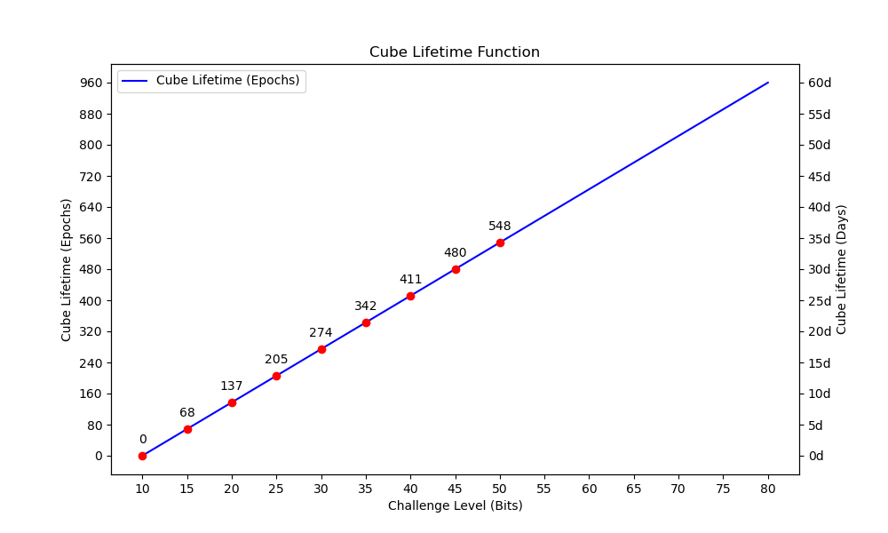

# Project Verity
This project aims to create a decentralized and censorship-resistant social networking platform akin to Twitter, Threads or Reddit. It leverages unique cube structures, each containing 1kB of data, which are then synchronized across participating nodes. To ensure data integrity and authenticity, posts are signed with user-specific cryptographic keys and utilize a hashcash challenge to mitigate spam. The platform supports 1:1 and 1:n encrypted messaging, protecting user privacy by minimizing metadata leakage and allowing secure, private communication between users. By offering a high degree of privacy, security, and resistance to censorship, this project offers a compelling alternative to traditional, centralized social networks.

Although light nodes are supported, nodes are encouraged to be operated as full nodes, replicating all cubes.

> Disclaimer: this project does not implement a cryptocurrency, nor does it resemble a blockchain.

# Cube Specification
Cubes are the elemental units of Verity. Every feature of the network is constructed on top of cubes.
1. **Total Size**: Each cube has a total size of 1024 bytes.

2. **Protocol Version and Reserved Bits (1 byte)**: The first nibble (4 bits) of the first byte of the cube is the protocol version. Currently, the only defined protocol version is 0. The second nibble of the first byte is reserved for future use.

3. **Date (5 bytes)**: The next 5 bytes represent the date when the cube was created, encoded as a truncated UNIX timestamp. This timestamp represents the number of seconds since the UNIX epoch (1970-01-01), truncated to 5 bytes. This is used to prune old cubes from the network. Cubes with dates from the future are to be rejected. (We may accept up to 24h into the future to account for time zone differences or make sure to use UTC.)

4. **Type-Length-Value (TLV) Fields (variable length)**: The rest of the cube consists of a series of TLV fields. Each field starts with a one-byte type identifier, followed by a length (types of static length may omit this) and the actual value. The type is a 6-bit identifier, and the length, if present, is encoded as a 10-bit integer, both packed into a two-byte header. The length is encoded as big endian.

  - **Type (6 bits)**: This is an identifier for the type of data. The defined types are as follows:

    - 0b000000: `TYPE_PAYLOAD`
    - 0b000001: `TYPE_RELATES_TO`
    - 0b000010: `TYPE_PADDING_NONCE`
    - 0b000011: `TYPE_KEY_DISTRIBUTION`
    - 0b000100: `TYPE_SHARED_KEY`
    - 0b000101: `TYPE_ENCRYPTED`
    - 0b000110: `TYPE_SIGNATURE`
    - 0b000111: `TYPE_SMART_CUBE`
    - 0b001000: `TYPE_PUBLIC_KEY`

    (Detailed description below)

  - **Length (10 bits, optional)**: This is the length of the value in bytes. For types with a fixed length, such as the "relates-to" hash (32 bytes), the digital signature (64 bytes), and the Shared Key (32 bytes), this field is omitted and the length is implicitly known. For types with variable length, this field specifies the length of the value.

  - **Value (variable length)**: This is the actual data. The length of this field is specified by the length field or is implicitly known based on the type.

5. **Type Fields**
  - **TYPE_PAYLOAD (optional, variable length)**: This is the main data payload of the cube, and its length can vary from 0 to the remaining size of the cube after accounting for other fields. The length utilizes the 10 bit length value of the TLV header. The payload can contain any data, but it is intended to hold the main content of the post or message.

  - **TYPE_KEY_DISTRIBUTION (optional, 40 bytes)**: This field is used to distribute symmetric keys for encrypted communications. It has a fixed size of 40 bytes and does not require a length field. The first 8 bytes represent the hash (fingerprint) of the recipient's public key. The following 32 bytes represent the ephemeral public key used to derive the symmetric key. The recipient can use their private key and the ephemeral public key to derive the same symmetric key for decrypting the associated `TYPE_ENCRYPTED` field.

  - **TYPE_SHARED_KEY (optional, 32 bytes)**: This field is used to store a symmetric key that has been encrypted with a previously distributed symmetric key. It has a fixed size of 32 bytes and does not require a length field. This symmetric key is used for decrypting other `TYPE_ENCRYPTED` fields and may be stored for future use.

  - **TYPE_ENCRYPTED (optional, variable length)**: This field holds encrypted data. It can contain any number of embedded TLV fields, which are to be parsed after decryption. The encryption key used is either the one associated with a preceding `TYPE_KEY_DISTRIBUTION` field in the same cube or a key previously distributed and stored in the recipient's key store. The first 8 bytes of the field contain the hash of the symmetric key (fingerprint) used for encryption, allowing the recipient to find the correct key for decryption. The rest of the field contains the encrypted data of further fields embedded within. (e.g. `TYPE_PAYLOAD` and `TYPE_SIGNATURE`)

  - **TYPE_RELATES_TO (optional, 33 bytes)**: If present, this field defines a certain relationship to another Cube. It consists of a one byte `RELATIONSHIP` class followed by the 32 byte key of another Cube. The `RELATIONSHIP` classes are defined as follows:
    - 1: `CONTINUED IN`: This cube contains incomplete data (e.g. because a single cube did not fit the whole payload) and is continued in the referenced cube. This cube, the referred cube and any further continuation shall be called a `continuation chain`. Only one `CONTINUED IN` relationship is allowed per cube. Client software shall attempt to retrieve the whole continuation chain in order to display the payload unabridged. Client software shall also treat non-payload fields across all cubes in the continuation chain same as non-payload fields in a single cube. Note that continuation chains are non-extendable as their member cubes are referenced front-to-back. This also ensures that all integrity guarantees of the first cube in the continuation chain (if any) extend to the whole chain, e.g. `SIGNATURE` fields don't have to be repeated in each member cube.
    TODO: Is this exploitable? As continuation chains have no defined start, an attacker could insert a new cube and claim it to be the be start of a preexisting chain, causing clients to locally construct nonsensical, conflicting and potentially large chain structures. We could require an additional hash over the whole chain in the last cube... but that wastes space of course.
    - 2: `MENTION`: This cube refers to a user. Multiple `MENTION` relationships are allowed per cube. The referred cube must be a MUC. Client software may scan cubes for MENTIONs of their user's own MUC to notify them of.
    - 3: `REPLY TO`: This cube's payload constitutes a reply to an earlier payload, available in the referenced cube. Client software may attempt to display the original cube alongside the reply. While client software may consider multiple `REPLY TO` relations per cube depending on the type of application, it is usually expected to only heed the first one.
    - 4: `QUOTATION`: This cube's payload refers to an earlier payload which client software shall usually display alongside this cube's payload. Multiple `QUOTATION` relationships are allowed per cube, in which case client software may provide an abridged view.

  is a continuation of another post. The field contains the hash of the post it relates to. The type code for this field is `TYPE_RELATES_TO`
  
  > **TODO**: This is to be replaced with the following: 
  TYPE_RELATES_TO (optional, 32 bytes) and TYPE_CONTINUES (optional, 32 bytes) 
  This removes one byte for the relationship class. Each of these two types can at most occur once per cube. (For performance reasons it may make sense to fix the position within the cube as well.) TYPE_RELATES_TO will be indexed by full nodes, which then provide a lookup service to light nodes. This allows displaying replies from users that one has not subscribed yet.

  - **TYPE_PADDING_NONCE (mandatory, variable length)**: As cubes are of fixed length (see total size above), a padding field is used to fill up each cube. If a signature field is used (see below), this fills the space between other cube contents and the signature. The padding field has a type of `TYPE_PADDING_NONCE`, and its length is calculated by subtracting the size all other fields, including the signature if present, from the total cube size. The last N bytes of the padding field serve as the nonce for the proof-of-work. The value of the nonce is initially set to zero, and is incremented with each attempt to generate a valid hash. The padding subfield length N is decided by the client but is recommended to be at least 4 bytes.

  - **TYPE_SIGNATURE (optional, 72 bytes)**: If present, the public key fingerprint and ED25519 signature are placed into this field as the last field in the cube. The field has a type of TYPE_SIGNATURE and does not have an associated length field because its size is fixed. The signature and fingerprint are calculated over all the bytes of the cube from the start up to and including the type byte of this signature field, as well as the fingerprint. The first 8 bytes contain the fingerprint of the public key, and the last 64 bytes of the field contain the signature.

  - **TYPE_SMART_CUBE (optional, fixed position, 0 byte value)**: If used, this field has to be first in the cube following the header. This type activates smart cube formats, such as MUC or IPC. It is only one byte long, leaving just 2 bits after the 6 bit type encoding:
   - 0b00: `CUBE_TYPE_MUC`
   - 0b01: `CUBE_TYPE_IPC`
   - 0b10: `CUBE_TYPE_RESERVED`
   - 0b11: `CUBE_TYPE_RESERVED2` (Could be used to enable another byte of payload)

- **TYPE_PUBLIC_KEY (optional, 32 bytes)**: This field stores an ED25519 public key. Given its fixed size of 32 bytes, it does not require an accompanying length field. It's used to share or broadcast the public key, enabling cryptographic operations like verifying signatures or initializing secure communications.

# Cube Store
  The cube store is part of each node and contains all the cubes known. While a full node is online it tries to keep its Node Store synchronized with the rest of the network by regularly synchronizing with all connected peers.

## Spam Prevention
  Verity has two primary defenses against Denial of Service (DoS):
### Hashcash
  The node's cube store sets a challenge level of trailing zeroes for each cube, any cubes that fail this challenge get rejected and dropped. The level initially will be hardcoded, but later may be adjusted to scale with the amount of data in the Cube Store. This is a well proven defense against spam and sufficiently effective.
### Ephemeral Cubes
  Cubes have a limited lifetime. By default they will only live for 7 days until dropped from the network. Though once switching to Merkle Patricia Trie (MPT) timestamps can be easily sorted into different subtrees, allowing flexible control over cube retention times. Nodes may regularly re-inject their posts to keep them available online, if desired.

  > Also see chapter Cube Lifetime Function

# Network Communication
  1. **Protocol Version (1 byte)**: This is the version of the protocol being used. This allows for future updates and backward compatibility. For now, you can set this to 0x01.

  2. **Message Class (1 byte)**: This is an identifier for the type of message. Here's a possible mapping:
  - `0x00`: `Hello`
  - `0x01`: `HashRequest`
  - `0x02`: `HashResponse`
  - `0x03`: `CubeRequest`
  - `0x04`: `CubeResponse`
  - `0x05`: `Unused - to be assigned`
  - `0x06`: `NodeRequest`
  - `0x07`: `NodeResponse`

  Each of these message classes will have different data payloads:
  - `Hello`: **Node Identifier (16 bytes)**: This is a unique NodeID that's randomly generated at startup. Primary purpose is to detect when we connected to ourselves. This may happen if we don't know our external IP. (e.g. NAT) Secondarily this may be used to detect duplicate connections to the same node, which may happen if the node is reachable via multiple IPs.

  - `HashRequest`: This message does not need any further data. The act of repeatedly sending it is sufficient to request all cube hashes iteratively. This message may get extended in the future to allow for more fine-grained control over which hashes to request. (e.g. by date or by MPT subtree)

  - `HashResponse`:
    - **Hash Count (4 bytes)**: This is an integer indicating the number of hashes being sent.
    - **Cube Details**: Each detail includes:
      - **Cube Type (1 byte)**: The type of the cube (e.g., regular, MUC, IPC).
      - **Challenge Level (1 byte)**: The challenge level the cube adheres to.
      - **Timestamp (5 bytes)**: The timestamp of the cube.
      - **Hash (32 bytes)**: The hash of the cube.

  - `CubeRequest`:
    - **Cube Hash Count (4 bytes)**: This is an integer indicating the number of cube hashes being requested.
    - **Cube Hashes (32 bytes each)**: This is a series of 32-byte hash values. The number of hashes should match the Cube Hash Count.

  - `CubeResponse`:
    - **Cube Count (4 bytes)**: This is an integer indicating the number of cubes being sent.
    - **Cubes (1024 bytes each)**: This is a series of cubes. Each cube is 1024 bytes as per your cube specification. The number of cubes should match the Cube Count.

  - `NodeRequest`: This message requests a list of known node addresses from a peer.
    - **Payload**: None

  - `NodeResponse`: This message provides a list of known node addresses to a peer.

    - Payload:
        - **Node Count (4 bytes)**: An integer indicating the number of node addresses being sent.
        - **Node Entries (variable length)**: A series of node entries. Each entry consists of:
          - **Node Address Length (2 bytes)**: An integer indicating the length of the node address.
          - **Node Address (variable length)**: The node address (e.g., WebSocket URL). The length of the address should match the Node Address Length.

# Encryption

## Cryptographic primitives used
   - All hashes are SHA3, truncated where sensible.
   - All signatures are ED25519
   - Fingerprints of either are truncated to 64 bit

  > Note: Signatures are very computationally expensive. Signing a cube with ED25519 is roughly 20 times as expensive as hashing with SHA3, verifying the signature even 60 times. Thus whenever signatures are to be verified, the cube challenge has to be verified first, in order to avoid creating a vector for Denial of Service (DoS).

**Key Distribution Field (`TYPE_KEY_DISTRIBUTION`):**

This type is used for fields that distribute a symmetric key for decryption of subsequent fields in the cube.

1. The sender creates an ephemeral Curve25519 key pair.
2. The sender uses the ephemeral private key and the recipient's public key (obtained from their address) to derive a shared symmetric key using `crypto_scalarmult_curve25519`.
3. The sender uses the shared symmetric key to encrypt the subsequent fields in the cube.
4. The field value for the `TYPE_KEY_DISTRIBUTION` field is composed of the following parts:
   - The 32-byte ephemeral public key, which the recipient will need to derive the same shared symmetric key.
   - A truncated 8-byte (64-bit) hash of the recipient's public key, so the recipient can identify that they are the intended recipient.

**Shared Key Field (`TYPE_SHARED_KEY`):**

This type is used for fields that deliver a symmetric key to the recipient. These fields can be placed within `TYPE_ENCRYPTED` sections and can be included multiple times to deliver multiple keys.

The field value for the `TYPE_SHARED_KEY` field is a 32-byte symmetric key, which the recipient should add to their key store for decrypting future messages.

**Encrypted Cube (`TYPE_ENCRYPTED`):**

This type is used for fields that contain encrypted data. The encryption is done using a symmetric key, which could be distributed in the same cube or derived from a key in the recipient's key store.

1. The field starts with an 8-byte (64-bit) hash/fingerprint of the symmetric key used for encryption. The recipient uses this hash to identify the correct key for decryption.
2. The rest of the field contains the encrypted data.

**1:1 Messages:**

For 1:1 messages, the sender creates a single cube with the recipient's public key and the message payload in the `TYPE_ENCRYPTED` section. This section is encrypted with a symmetric key derived using `crypto_scalarmult_curve25519` and the ephemeral key pair. The cube also contains a `TYPE_KEY_DISTRIBUTION` field with the ephemeral public key and the hash of the recipient's public key.

**1:n Messages:**

For 1:n messages, the sender creates multiple cubes, one for each recipient. Each cube contains a `TYPE_KEY_DISTRIBUTION` field with an ephemeral public key (different for each cube) and the hash of the recipient's public key. The `TYPE_ENCRYPTED` section of each cube can contain the same or different payloads for each recipient.

Additionally, the sender can include one or more `TYPE_SHARED_KEY` fields within the `TYPE_ENCRYPTED` section of each cube. These fields contain symmetric keys that the recipients should add to their key store for decrypting future messages. This allows the sender to establish multiple shared keys with each recipient in a single cube.

This comprehensive system allows for secure, efficient, and flexible communication, supporting both 1:1 and 1:n messages while minimizing metadata leakage and cube size. It also provides a robust mechanism for nodes to quickly identify and retrieve relevant data.

## Design
### Logo

The dove Vera (short for Veracity) is the logo of Verity. The dove not only signifies peace, harmony, and purity, but also symbolizes the free spirit of a decentralized network that cannot be caged or controlled, much like the dove itself.
### Names
#### Verity
Verity was chosen as the name of the project. It aligns with the project goals and is conscise, yet not too common. Verity is another word for "truth". It's shorter and simpler than Veracity, but similar in meaning.

#### Veracity
This word means "truthfulness" or "accuracy", which could refer to the authenticity and integrity of the cubes in the network. It's an uncommon word, which could make the project stand out, but it may also be less immediately understandable to some users.

## Outlook
### Network
- `Light Nodes`: Besides full nodes with full replication one can also operate light nodes that only request cubes on demand. They should prefer to connect to full nodes and communicate their status as network leaves.
- `Bloom filters`: To further improve efficiency light nodes receive bloom filters of connected nodes in order to determine which peers to request cubes from.
- `DHT Nodes`: Another extension could be DHT nodes. Instead of aiming for full replication, these nodes just replicate a portion of the cube-space within their DHT address range. They have a bit less utility to the network, but also can operate with less resources.
- `Merkle Patricia Trie`: To improve efficiency during synchronization we can store all hashes in an MPT. This would allow efficient comparison and synchronization with a complexity of O(log(n)). Likely advisable to scale beyond a million cubes per day.

When two nodes synchronize, they compare the root hash of their MPTs. If the hashes are different, this indicates that the nodes have a different set of cubes. The nodes can then recursively compare the hashes of their children, continuing down the tree, until they identify the cubes that differ. This allows the nodes to find the specific cubes that need to be updated, without having to compare every single cube hash.

### Client
- `Reference Client`: The reference client is to be written in TypeScript and supports a WebSocket transport. This will allow porting the client to the web for easier access. PWA could be an option, especially for light nodes.
> TODO: PWAs prohibit self-signed certificates. By switching to WebRTC we can avoid this issue and also gain NAT traversal.
### Features
- `Accounts`: Identities will be implemented through asymmetric cryptography. Users can create one or more public/private key pairs and use them to receive direct messages addressed to the hash of their public key, as well as to sign their messaged.

### Mutable User Cubes (MUCs)

Mutable User Cubes (MUCs) are a smart type of cube in the Verity network that can be updated by their respective owners. This functionality provides users with the flexibility to change the content of these cubes while preserving their identity within the network.

#### Specification

MUCs are similar to standard cubes, but with additional fields to implement ownership:

1. **TYPE_SMART_CUBE**: Indicating the cube is a MUC.

2. **TYPE_PUBLIC_KEY**: This is the user's public key. It serves to verify the signature of the cube. The public key is used to track the cube within the network, like the cube hash does for regular cubes. The cube hash of a MUC still serves to verify the challenge of the cube, keeping challenge verification consistent among cube types.

3. **TYPE_SIGNATURE**: This is the user's signature of the cube, which is verified with the key in the TYPE_PUBLIC_KEY field. This proves ownership of the cube.

#### Functionality
The content of a MUC can be updated by the user, and the updated cube is signed with the user's private key. The signature can be verified with the public key in the cube. When a MUC is updated, the timestamp is set to the current time. This timestamp serves as the version number for the cube. The cube with the latest timestamp is considered the most recent version.

#### Conflict Resolution
In the event of a conflict where different versions of the same MUC exist within the network with the same timestamp, the mainline client will keep the local cube. Clients may optionally compare cube hashes and favor the cube with the lexicographically higher hash. This deterministic method ensures a fair resolution of conflicts and doesn't inherently favor any particular cube.

### Immutable Persistence Cubes (IPCs)

Immutable Persistence Cubes (IPCs) are a distinct type of cube in the Verity network. Unlike regular cubes that expire after 7 days, and Mutable User Cubes (MUCs) that can only be extended in their lifetime by their respective owners, IPCs are static and their content cannot be updated once created. However, their lifespan can be extended by any network participant, allowing them to potentially exist in perpetuity.

#### Specification

IPCs are similar to standard cubes and MUCs, but with a unique identification method:

1. **Partial Hash Key**: Each IPC is tracked under a key that is derived by hashing most of the cube content, excluding the date and the padding/nonce. This guarantees that the same stored data will always result in the same key, thereby preserving cube identity even when their lifespan is extended. Their full hash still has to meet the regular challenge requirements.
 > TODO: Consider swapping the header byte with the date bytes for easier sequential hashing of IPCs. Ideally their key can be derived in one go.

#### Extension of Lifespan

Any network participant can sponsor an extension of the lifespan of an IPC by setting the date to the current date and solving the nonce to meet the hashcash requirement. This process results in a new cube with the same key (due to the identical content) but a newer date, effectively replacing the older version of the cube in the network. As long as any client appreciates the content and occasionally renews the date, these cubes could theoretically exist indefinitely.

#### Conflict Resolution

In the event of a conflict where different versions of the same IPC exist within the network, the cube lifetime function is used to determine the cube with the longest lifespan. The cube with the longest lifespan is considered the most recent version and is to be favored.

## Cube Lifetime Function

In the Verity network, the lifetime of cubes can be extended by increasing the hashcash challenge level. The function that determines the cube lifetime, given the hashcash challenge level, is designed to provide a balance between computational investment and the extension of cube lifetime.

### Function Definition

The function that determines the cube lifetime is given by:

$$f(x) = \frac{{d_{1} - d_{2}}}{{\log_2(c_{1}) - \log_2(c_{2})}} \cdot \log_2(x) + \frac{{d_{1} \cdot \log_2(c_{2}) - d_{2} \cdot \log_2(c_{1})}}{{\log_2(c_{2}) - \log_2(c_{1})}}$$

where:

- $x$ is the hashcash challenge level,
- $d_{1}$ and $d_{2}$ are the lower and upper bounds for the cube lifetime, respectively, and
- $c_{1}$ and $c_{2}$ are the lower and upper bounds for the hashcash challenge level, respectively.

### Plot ###

### Function Properties

The cube lifetime function has several key properties that make it well-suited for its role in the Verity network:

1. **Growth Rate**: The function exhibits sub-linear growth. This means that as the hashcash challenge level increases, the cube lifetime also increases, but at a decreasing rate. This property ensures that while investing more computational resources can extend the cube lifetime, there are diminishing returns for each additional bit in the hashcash challenge level.

2. **Monotonicity**: The function is strictly increasing for $x > 0$ if $d_{1} < d_{2}$ and $c_{1} < c_{2}$. This means that a higher hashcash challenge level will always result in a longer cube lifetime.

3. **Continuity and Differentiability**: The function is continuous for $x > 0$ and differentiable for $x > 0$, which means it has no breaks, jumps, or sharp turns for $x > 0$. This ensures that small changes in the hashcash challenge level lead to small changes in the cube lifetime.

4. **Bounds**: The function correctly maps a hashcash challenge level of $c_{1}$ bits to a cube lifetime of $d_{1}$ days, and a challenge level of $c_{2}$ bits to a cube lifetime of $d_{2}$ days. This allows the network to control the minimum and maximum cube lifetimes.
